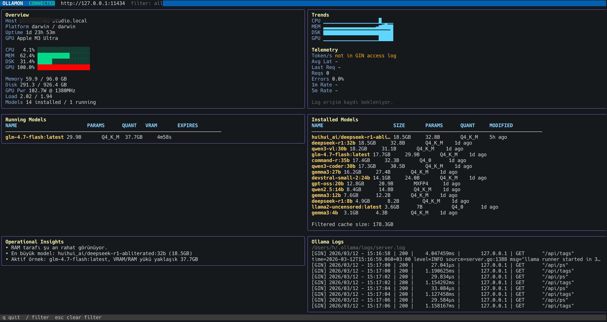

# ollamon

`ollamon` is a terminal monitor for Ollama nodes.

It provides a TUI focused on operational visibility:

- installed models
- running models
- CPU, memory, disk, and GPU activity
- Ollama access-log telemetry
- lightweight operational insights

## Screenshot

Add your screenshot file and update the path below if needed:



## Features

- Live overview for host and Ollama runtime state
- Running and installed model panels
- Access-log telemetry from Ollama `server.log`
- Filterable model views
- Mini trend charts for CPU, memory, disk, and GPU
- GPU metrics on macOS via [`agputop`](https://github.com/hbasria/agputop)

## Install

One-line install:

```bash
curl -fsSL https://raw.githubusercontent.com/hbasria/ollamon/main/scripts/install.sh | sh
```

Install only, without launching:

```bash
curl -fsSL https://raw.githubusercontent.com/hbasria/ollamon/main/scripts/install.sh | sh -s -- --no-run
```

Install a specific version:

```bash
curl -fsSL https://raw.githubusercontent.com/hbasria/ollamon/main/scripts/install.sh | sh -s -- --version v0.1.0
```

Supported targets:

- `darwin/amd64`
- `darwin/arm64`
- `linux/amd64`
- `linux/arm64`

## Run

```bash
make build
./bin/ollamon
```

For development:

```bash
make run
```

## Configuration

Environment variables:

- `OLLAMA_HOST`
- `OLLAMON_INTERVAL_MS`
- `OLLAMON_REQUEST_TIMEOUT_MS`
- `OLLAMON_DISK_PATH`
- `OLLAMON_LOG_PATH`
- `OLLAMON_COMPACT`

Example:

```bash
OLLAMA_HOST=http://127.0.0.1:11434 \
OLLAMON_INTERVAL_MS=2000 \
OLLAMON_REQUEST_TIMEOUT_MS=5000 \
make run
```

## Logs

By default, `ollamon` reads Ollama access logs from:

```bash
~/.ollama/logs/server.log
```

You can override this with:

```bash
OLLAMON_LOG_PATH=/path/to/server.log
```

## GPU Metrics

On macOS, GPU telemetry is collected from [`agputop`](https://github.com/hbasria/agputop) using its JSON output.

Example command:

```bash
agputop --json
```

If `agputop` is not available, `ollamon` falls back to basic GPU detection.

## Notes

- Access-log-derived telemetry can show API latency, request counts, and endpoint activity.
- Token throughput is only shown when the underlying telemetry source exposes it.
